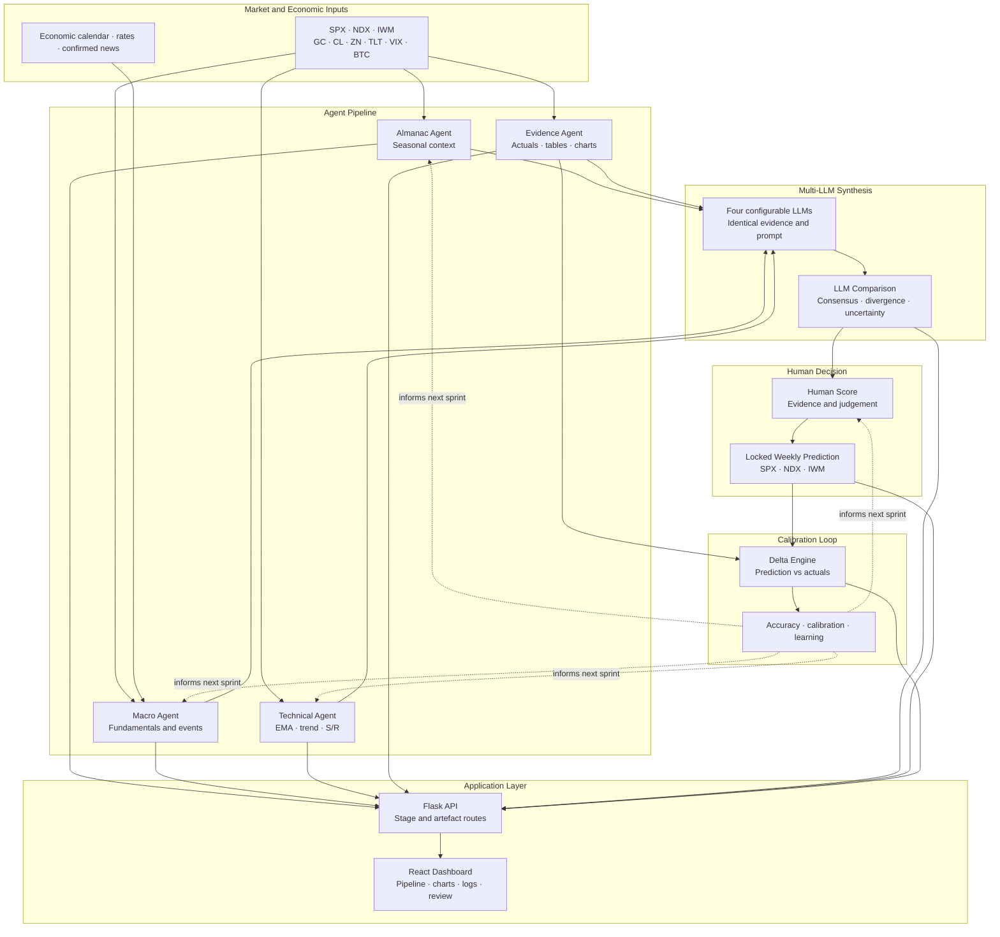

<div align="center">

<sub>CP3405 Design Thinking 3 &nbsp;·&nbsp; TR2 2026 &nbsp;·&nbsp; Singapore &nbsp;·&nbsp; Prof. Dr. Tan</sub>

# Market Intelligence — Team 1

<sub>A 10-week Scrum project for automated market analysis, multi-LLM collaboration, human review, and calibrated prediction.</sub>

<br>


</div>

---

## Project Overview

Team 1 is building a repeatable market-intelligence system that combines market data, specialised analysis agents, four large language models, human judgement, and weekly calibration.

The project follows a continuous two-part feedback loop:

- **Look forward:** collect fresh data, run the agents, compare LLM reasoning, complete the Human Score, and lock the next SPX, NDX, and IWM prediction.
- **Look back:** compare the previous locked prediction with actual market results, calculate accuracy, and record lessons for the next sprint.

By Week 10, the repository should contain a transparent history of weekly predictions, evidence, LLM outputs, human decisions, actual results, calibration reports, and software increments.

---

## Current Development Status

> **Snapshot: 18 July 2026**  
> Done Implemented or usable &nbsp;·&nbsp; On-going Active integration or review &nbsp;·&nbsp; TO-DO Planned

| Component | Status | Current State |
|---|:---:|---|
| Structured weekly prediction workflow | Done | The team produces SPX, NDX, and IWM direction, percentage range, confidence, reasoning, and invalidation conditions. |
| Automated agent pipeline | Done | Almanac, Technical, Macro, and Evidence stages can run from the Python pipeline. |
| Macro Agent automation | Done | News and macro inputs no longer require regular manual entry. Free APIs and transformed HTML data replace several paid sources. |
| Evidence Agent and generated charts | Done | The pipeline can fetch actual market data, create evidence artefacts, and generate chart images. |
| Multi-LLM synthesis | Done | Four models receive the same evidence and prompt so their conclusions can be compared consistently. |
| Flask backend API | Done | Stage execution and saved-artifact access are exposed through backend server routes. |
| React dashboard | Done | The dashboard is usable end-to-end in demo mode and includes pipeline, agents, charts, logs, calibration, and review screens. |
| Live frontend–backend connection | On-going | Integration work has started and server endpoints exist. Some frontend API adapters still use bundled example data and require final replacement. |
| Delta Engine | On-going | Core comparison logic, tests, and pipeline integration have been developed. Full merge, API exposure, and dashboard integration remain active work. |
| Human Score pipeline integration | On-going | The Human Score format exists and is used manually. Automated persistence and pipeline integration are still being completed. |
| Historical views and richer graphs | On-going | The frontend supports saved-week and chart concepts. Further historical-data integration and visual refinement are in progress. |
| Local LLM test provider | On-going | Local Ollama support has been added for more reliable development and testing without depending entirely on external API availability. |
| CI, type checks, and tests | Done | GitHub Actions, Pyright, pytest, frontend build checks, and pull-request review are part of the development workflow. |

---

## Weekly Intelligence Cycle

Each sprint follows the same evidence-to-learning cycle:

1. **Select the prediction window** after the US market closes.
2. **Fetch market and economic data** for three target indices and six supporting assets.
3. **Run the analysis stages** for Almanac, Macro, Technical, and Evidence.
4. **Query four LLMs** with an identical synthesis prompt.
5. **Compare model outputs** to identify agreement, disagreement, missing evidence, and uncertainty.
6. **Apply human judgement** through the Human Score review.
7. **Lock the prediction** for SPX, NDX, and IWM.
8. **Publish the artefacts** through GitHub and the project interface.
9. **Evaluate the previous prediction** through the Delta Engine.
10. **Record calibration and learning** for the next sprint.

---

## The Nine Tracked Assets

The three equity indices are the prediction targets. The other six assets provide macroeconomic, volatility, and risk-sentiment context.

<table>
<thead>
<tr>
<th align="left">Asset</th>
<th align="left">Ticker</th>
<th align="left">Why We Track It</th>
</tr>
</thead>
<tbody>
<tr>
<td><b>S&amp;P 500</b></td>
<td><code>SPX</code></td>
<td>The main US equity benchmark and one of the three weekly prediction targets.</td>
</tr>
<tr>
<td><b>Nasdaq 100</b></td>
<td><code>NDX</code></td>
<td>A technology-heavy index that often reacts strongly to rates and risk sentiment.</td>
</tr>
<tr>
<td><b>Russell 2000 ETF</b></td>
<td><code>IWM</code></td>
<td>A small-cap proxy that is sensitive to financing conditions and domestic growth.</td>
</tr>
<tr>
<td><b>Gold Futures</b></td>
<td><code>GC</code></td>
<td>A safe-haven, inflation, currency, and market-fear signal.</td>
</tr>
<tr>
<td><b>Crude Oil Futures</b></td>
<td><code>CL</code></td>
<td>An inflation driver and a signal for global demand and geopolitical risk.</td>
</tr>
<tr>
<td><b>10-Year Treasury Futures</b></td>
<td><code>ZN</code></td>
<td>A rates and duration proxy that helps explain pressure on equity valuations.</td>
</tr>
<tr>
<td><b>Long-Term US Treasury ETF</b></td>
<td><code>TLT</code></td>
<td>A bond-market signal for growth expectations, rates, and risk-off behaviour.</td>
</tr>
<tr>
<td><b>CBOE Volatility Index</b></td>
<td><code>VIX</code></td>
<td>A widely used measure of expected equity-market volatility and investor fear.</td>
</tr>
<tr>
<td><b>Bitcoin</b></td>
<td><code>BTC</code></td>
<td>A continuously traded proxy for speculative risk appetite and liquidity sentiment.</td>
</tr>
</tbody>
</table>

---

## Analysis and Evidence Agents

The system contains **three analytical agents** and **one evidence agent**.

| Agent | Purpose | Main Outputs |
|---|---|---|
| **Almanac Agent** | Reviews seasonal patterns, month and day effects, sector seasonality, and market-cycle context. Seasonal evidence is treated cautiously because historical patterns can break. | Seasonal bias, supporting patterns, confidence, and limitations. |
| **Macro Agent** | Collects fundamental drivers such as rates, yields, oil, economic events, market expectations, and confirmed news. It separates facts, expectations, and interpretation. | Macro bias, event calendar, evidence, scoring, and risk factors. |
| **Technical Agent** | Analyses price action, 8-day and 21-day EMAs, trend structure, support, resistance, and invalidation levels. | Directional bias, measured levels, chart evidence, and invalidation conditions. |
| **Evidence Agent** | Fetches actual market data and produces the evidence needed by the agents, calibration process, and Delta Engine. | Actuals, market tables, screenshots, generated charts, and reusable evidence artefacts. |

Typical artefact locations:

```text
data/almanac/almanac_agent_WXX.md
data/macro/macro_agent_WXX.md
data/technical/technical_agent_WXX.md
data/evidence/
data/charts/
```

---

## Multi-LLM Synthesis

After the analysis artefacts are prepared, the same synthesis prompt is sent to four models. Their responses are stored separately and compared before the Human Score is completed.

<table>
<tr>
<td width="25%" align="center" valign="top">

**Nemotron 3 Super**
<br><sub>NVIDIA</sub>

<br><sub><code>synthesis_nemotron_WXX.txt</code></sub>

</td>
<td width="25%" align="center" valign="top">

**gpt-oss-120b**
<br><sub>OpenAI</sub>

<br><sub><code>synthesis_gptoss_WXX.txt</code></sub>

</td>
<td width="25%" align="center" valign="top">

**Gemma 4 31B**
<br><sub>Google</sub>

<br><sub><code>synthesis_gemma_WXX.txt</code></sub>

</td>
<td width="25%" align="center" valign="top">

**Laguna M.1**
<br><sub>Poolside</sub>

<br><sub><code>synthesis_laguna_WXX.txt</code></sub>

</td>
</tr>
</table>

The model roster is configurable in `backend/pipeline.toml`. A local Ollama provider is also being used as an optional development and testing path.

The comparison stage records:

- directional calls for SPX, NDX, and IWM;
- predicted percentage ranges and confidence;
- areas of model agreement;
- major disagreements and uncertainty;
- evidence quality and reasoning strength;
- contradictions between model claims and source artefacts; and
- points that require human judgement.

---

## Human Score and Final Prediction

The Human Score is the final review layer before a prediction is locked. It does not simply follow the majority of the LLMs.

The reviewer checks:

- whether each conclusion is supported by evidence;
- whether important market events were missed;
- whether confidence matches the level of uncertainty;
- whether the agents or models contradict each other;
- whether the prediction range is realistic;
- what evidence would invalidate the prediction; and
- whether the human conclusion should validate or override the AI consensus.

The final prediction records:

```text
SPX: direction + percentage range
NDX: direction + percentage range
IWM: direction + percentage range
Confidence: low / medium / high
Main reasoning
Main risks
Invalidation condition
```

Typical output:

```text
data/human/human_score_WXX.md
data/final prediction/prediction_YYYY-WXX.md
```

---

## Delta Engine and Calibration

The Delta Engine closes the weekly feedback loop by comparing a **locked prediction** with the **actual market result**.

It is designed to calculate:

- direction accuracy;
- range accuracy;
- prediction error percentage;
- per-index results for SPX, NDX, and IWM;
- an overall structured delta report;
- evidence for calibration review; and
- possible future weight adjustments.

```text
Locked Prediction + Actual Results
                │
                ▼
          Delta Engine
                │
        ┌───────┼────────┐
        ▼       ▼        ▼
   Direction   Range    Error
   Accuracy   Accuracy  Percentage
        └───────┼────────┘
                ▼
      Calibration and Learning
```

> **Current status:** the core Delta Engine logic and tests have been developed, and pipeline integration has started. Full backend, frontend, and Human Score integration remains in progress.

Typical output:

```text
data/qa/delta_WXX.md
```

---

## System Architecture



---

## Running the Backend Pipeline

### Requirements

- Python 3.12+
- [`uv`](https://docs.astral.sh/uv/)
- API keys listed in `backend/.env.example`

### Setup

```bash
cd backend
cp .env.example .env
uv sync
```

Fill in the required values in `backend/.env`. Never commit real API keys.

### Run

```bash
uv run python run_pipeline.py
```

Run with the CI configuration:

```bash
uv run python run_server.py
uv run python run_pipeline.py --config pipeline.ci.toml
```

Configure the prediction date, enabled stages, LLM models, retry behaviour, and output formats in:

```text
backend/pipeline.toml
backend/pipeline.ci.toml
backend/server.toml
```

---

## Running the Backend API

The Flask application factory is located in `backend/server/`.

```bash
cd backend
uv run flask --app "server:create_app" run --debug
```

The server provides routes for pipeline-stage execution and saved artefacts. Endpoint coverage will continue to expand as the Delta Engine and Human Score are integrated.

---

## Running the Frontend

### Requirements

- Node.js
- npm

### Start the dashboard

```bash
cd frontend
npm install
npm run dev
```

Open:

```text
http://localhost:3000
```

The dashboard currently includes:

- pipeline-stage controls;
- Almanac, Macro, and Technical output cards;
- multi-LLM comparison;
- market charts;
- execution logs;
- calibration views;
- saved-week selection; and
- a Human Score review form.

The bundled demo data provides the most reliable standalone demonstration. The Flask API exists, but some frontend API modules still need to replace their example-data responses with live requests.

---

## Quality Assurance

Backend checks:

```bash
cd backend
uv run pyright agents/
uv run pytest tests/
```

Equivalent Makefile shortcuts:

```bash
make check
make test
```

Frontend checks:

```bash
cd frontend
npm run build
```

The repository uses GitHub Actions for automated pipeline, backend, agent, and frontend checks.

### Pull-Request Expectations

A pull request should:

1. address one clear feature, fix, or sprint artefact;
2. include meaningful tests where appropriate;
3. pass type checking and automated checks;
4. avoid placeholder tests that pass without validating behaviour;
5. resolve merge conflicts before final review;
6. explain how the change was tested; and
7. be reviewed before it is merged into `main`.

---

## Repository Structure

<sub>The structure may continue to change as integration work is completed.</sub>

```text
team1-prac-a-project/
├── README.md
├── CONTRIBUTING.md
├── CODE_OF_CONDUCT.md
├── LICENCE.md
├── .github/
│   └── workflows/                     # CI, pipeline, agent and build checks
├── backend/
│   ├── agents/
│   │   ├── almanac/                   # Seasonal analysis automation
│   │   ├── macro/                     # Macro and news automation
│   │   ├── technical/                 # Technical analysis automation
│   │   ├── evidence/                  # Actuals, evidence and chart generation
│   │   ├── llm/                       # LLM providers and synthesis
│   │   └── pipeline/                  # Shared pipeline orchestration
│   ├── server/                        # Flask stage and artefact API
│   ├── tests/                         # pytest test suite
│   ├── .env.example
│   ├── Makefile
│   ├── pipeline.toml
│   ├── server.toml
│   ├── pipeline.ci.toml
│   └── run_pipeline.py
├── frontend/
│   ├── src/
│   │   ├── api/                       # Frontend API boundary
│   │   ├── app/                       # Application shell
│   │   ├── components/                # Shared UI components
│   │   ├── hooks/                     # Pipeline state and actions
│   │   ├── lib/                       # Helpers and demo data
│   │   └── pages/                     # Dashboard application pages
│   └── docs/screenshots/
├── data/
│   ├── almanac/
│   ├── macro/
│   ├── technical/
│   ├── evidence/
│   ├── charts/
│   ├── llm/
│   ├── human/
│   ├── final prediction/
│   ├── qa/                            # Delta and calibration reports
│   ├── formats/
│   └── outputs/
├── presentations/
├── scripts/
├── sprints/
└── tasks/
```

---

## Progress So Far

### Early Sprints

- Defined the sprint goal, acceptance criteria, Definition of Done, and weekly prediction format.
- Established protected-branch and pull-request practices.
- Created the Almanac, Macro, Technical, Evidence, LLM comparison, Human Score, final prediction, and QA artefact structure.
- Completed weekly manual predictions and calibration reports to establish the baseline workflow.

### Automation Increment

- Added shared Python schemas, agent interfaces, file handling, and pipeline orchestration.
- Automated Almanac, Macro, Technical, and Evidence stages.
- Added OpenRouter-based multi-LLM synthesis.
- Added scheduled and CI pipeline configurations.
- Added generated market charts and evidence outputs.

### Application Increment

- Added a Flask backend server for stage execution and artefact access.
- Added a React and Vite dashboard with pipeline, chart, log, calibration, and review screens.
- Added a browser-only demo mode so the UI can be reviewed without Python or API keys.
- Started live backend–frontend integration.

### Calibration Increment

- Developed the Delta Engine for prediction-versus-actual comparison.
- Added direction, range, and error calculations.
- Added tests and Pyright validation.
- Started pipeline integration and planned API, dashboard, and Human Score connections.

---

## Known Limitations and Active Risks

- External LLM and data-provider rate limits can cause a pipeline stage to fail.
- The automated Macro Agent depends on free APIs and transformed web data, which may change without notice.
- Delta reports require both a locked prediction and complete actual-results artefacts.
- Some frontend API adapters still return bundled example data.
- Human Score persistence and automatic pipeline integration are not complete.
- Historical views, richer graphs, and final frontend polish remain active development tasks.
- The repository structure and output paths may change while branches are merged and refactored.

---

## Resources and References

<table>
<thead>
<tr>
<th align="left">Resource</th>
<th align="left">Purpose</th>
</tr>
</thead>
<tbody>
<tr>
<td><a href="https://dt3-tr2-26-market-intelligence.pages.dev/"><b>DT3 Current Task Brief</b></a></td>
<td>Official course materials</td>
</tr>
<tr>
<td><a href="./tasks/W2Task.html"><b>DT3 Week 2 Task Brief</b></a></td>
<td>Local backup of the Week 2 task</td>
</tr>
<tr>
<td><a href="./tasks/W3Task.html"><b>DT3 Week 3 Task Brief</b></a></td>
<td>Local backup of the Week 3 task</td>
</tr>
<tr>
<td><a href="https://discord.com/channels/1505861202444816455/1505883026771677366"><b>CP3405 Discord</b></a></td>
<td>Team communication and announcements</td>
</tr>
<tr>
<td><a href="https://finviz.com/futures_performance.ashx"><b>Finviz Futures Performance</b></a></td>
<td>Weekly futures and cross-asset performance</td>
</tr>
<tr>
<td><a href="https://finance.yahoo.com/sectors/"><b>Yahoo Finance Sectors</b></a></td>
<td>US sector performance</td>
</tr>
<tr>
<td><a href="https://tradingeconomics.com/calendar"><b>Trading Economics Calendar</b></a></td>
<td>Week-ahead economic events</td>
</tr>
<tr>
<td><a href="https://www.cmegroup.com/markets/interest-rates/cme-fedwatch-tool.html"><b>CME FedWatch Tool</b></a></td>
<td>Market-implied Federal Reserve rate probabilities</td>
</tr>
</tbody>
</table>

---

## Contributing

See [CONTRIBUTING.md](CONTRIBUTING.md) for the Git workflow, commit-message format, and coding conventions.

**Key rule:** all changes to `main` require a pull request. Do not push directly to the protected branch.

When submitting a pull request, include:

- a concise description of the problem and solution;
- the sprint or issue it supports;
- testing evidence;
- screenshots for visual changes;
- any known limitations; and
- the reviewer or role that should validate the change.

---

## Educational Disclaimer

This repository is an educational project for CP3405 Design Thinking 3. Its market analysis and predictions are not financial advice.
