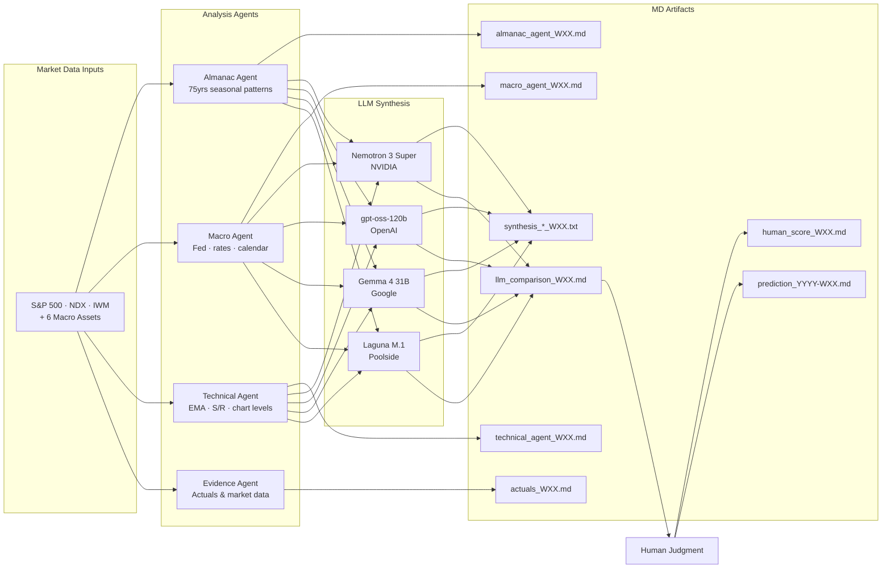

<div align="center">

<sub>CP3405 Design Thinking 3 &nbsp;·&nbsp; TR2 2026 &nbsp;·&nbsp; Singapore &nbsp;·&nbsp; Prof. Dr. Tan</sub>

# Market Intelligence — Team 1

<sub>A 10-week sprint exercise in structured market analysis, AI collaboration, and calibrated prediction.</sub>

<br>


</div>

---

## Project Overview

Each week, our team runs a full intelligence cycle:

1. **Reads real market data** — S&P 500, Nasdaq 100, Russell 2000, and 8 macro assets
2. **Builds structured analysis** — Almanac (seasonal), Macro (fundamentals), and Technical (chart) agents
3. **Queries four AI models** — Claude, ChatGPT, Gemini, DeepSeek with identical prompts
4. **Applies human judgment** — Our team's reasoning overrides or validates AI consensus
5. **Makes a prediction** — SPX, NDX, IWM direction + % range + confidence level
6. **Measures calibration** — Were we right *and* confident, or wrong *but* honest about uncertainty?

By Week 10 we will have a 10-sprint track record of predictions vs. actuals, a public GitHub history showing our reasoning, and a live web application that any user can access to see our analysis.

---

## The Nine Tracked Assets

<table>
<thead>
<tr>
<th align="left">Asset</th>
<th align="left">Ticker</th>
<th align="left">Why We Track It</th>
</tr>
</thead>
<tbody>
<tr>
<td><b>S&amp;P 500</b></td>
<td><code>SPX</code></td>
<td>The benchmark. 500 largest US companies.</td>
</tr>
<tr>
<td><b>Nasdaq 100</b></td>
<td><code>NDX</code></td>
<td>Tech-heavy. Fastest-moving index.</td>
</tr>
<tr>
<td><b>Russell 2000</b></td>
<td><code>IWM</code></td>
<td>Small caps. Most rate-sensitive.</td>
</tr>
<tr>
<td><b>Gold</b></td>
<td><code>GC</code></td>
<td>Safe haven. Inflation &amp; fear gauge.</td>
</tr>
<tr>
<td><b>Crude Oil</b></td>
<td><code>CL</code></td>
<td>Inflation driver. Geopolitical signal.</td>
</tr>
<tr>
<td><b>10-Year Treasury Yield</b></td>
<td><code>ZN</code></td>
<td>The gravity on all asset valuations.</td>
</tr>
<tr>
<td><b>US Bonds</b></td>
<td><code>TLT</code></td>
<td>Stocks + bonds both down = fear signal.</td>
</tr>
<tr>
<td><b>VIX</b></td>
<td><code>VIX</code></td>
<td>Volatility index. Fear measure. 15 = calm, 30+ = panic.</td>
</tr>
<tr>
<td><b>Bitcoin</b></td>
<td><code>BTC</code></td>
<td>Risk appetite proxy. 24/7 trading.</td>
</tr>
</tbody>
</table>

---

## The Three-Agent Framework

<table>
<tr>
<td width="33%" valign="top">

**Almanac Agent** &nbsp;<sub>R3</sub>

Seasonal patterns from 75 years of market history. This week's month rank, day-of-week effects, sector seasonality, and presidential cycle context.

Confidence is deliberately lower than charts — patterns break.

<sub><code>data/almanac/almanac_agent_WXX.md</code></sub>

</td>
<td width="33%" valign="top">

**Macro Agent** &nbsp;<sub>R4</sub>

The fundamental drivers: Fed rate probabilities, yield curve, dollar, oil, economic calendar surprises, confirmed news events.

Separated into three layers — confirmed facts, market expectations, and our interpretation.

<sub><code>data/macro/macro_agent_WXX.md</code></sub>

</td>
<td width="33%" valign="top">

**Technical Agent** &nbsp;<sub>R5</sub>

Chart reading: 8-day EMA, 21-day EMA, trendlines, support/resistance levels. Specific invalidation levels.

No vague calls like "looks bullish" — only measured statements like "bullish while above 7,350."

<sub><code>data/technical/technical_agent_WXX.md</code></sub>

</td>
</tr>
</table>

---

## Pipeline Architecture



---

## Running The Pipeline

**Dependencies:** Python 3.12+, [uv](https://docs.astral.sh/uv/)

**Environment:** Copy `backend/.env.example` to `backend/.env` and fill in your keys. `OPENROUTER_API_KEY` is always required. `FRED_API_KEY` is only needed when `macro = true` in `pipeline.toml`.

**Run:**

```bash
cd backend
uv run python run_pipeline.py                        # uses pipeline.toml (dev)
uv run python run_pipeline.py --config pipeline.ci.toml  # uses CI config
```

Configure prediction date, enabled stages, and LLM models in `backend/pipeline.toml`. `backend/pipeline.ci.toml` is used by GitHub Actions and always runs with `auto` date and all stages enabled. The pipeline runs automatically every Friday.

---

## Multi-LLM Synthesis

After the three agents are built, we paste them into an identical prompt and query all four models. We save all four raw responses and fill a comparison table — where do they agree (high confidence), where do they diverge (flag as uncertainty), and which model's reasoning is strongest this week.

<table>
<tr>
<td width="25%" align="center" valign="top">

**Nemotron 3 Super**
<br><sub>NVIDIA</sub>

<br><sub><code>synthesis_nemotron_WXX.txt</code></sub>

</td>
<td width="25%" align="center" valign="top">

**gpt-oss-120b**
<br><sub>OpenAI</sub>

<br><sub><code>synthesis_gptoss_WXX.txt</code></sub>

</td>
<td width="25%" align="center" valign="top">

**Gemma 4 31B**
<br><sub>Google</sub>

<br><sub><code>synthesis_gemma_WXX.txt</code></sub>

</td>
<td width="25%" align="center" valign="top">

**Laguna M.1**
<br><sub>Poolside</sub>

<br><sub><code>synthesis_laguna_WXX.txt</code></sub>

</td>
</tr>
</table>

---


## Repository Structure

<sub>May not be fully up to date</sub>

```
team1-prac-a-project/
├── README.md                          # This file
├── CONTRIBUTING.md                    # Git workflow & coding standards
├── CODE_OF_CONDUCT.md                 # Code of conduct
├── LICENCE.md                         # Project licencing 
├── /.github/                          # GitHub Actions
├── /backend/                          # Automatic fetching code 
├── /sprints/                          # Sprint details
├── /scripts/                          # Various helper scripts
├── /data/
│   ├── /evidence/                     # Data & screenshots 
│   ├── /almanac/                      # Analysis from Investors Almanac
│   ├── /macro/                        # Fundamental analysis
│   ├── /technical/                    # Technical analysis
│   ├── /charts/                       # Charts Screenshots
│   ├── /llm/                          # LLM outputs and comparisons
│   ├── /formats/                      # Formats for each agent
│   ├── /final prediction/             # Our final prediction
│   ├── /qa/                           # Quality assurance
│   └── /human/                        # Human predictions
└── /presentations/                    # Class presentations
```
---

## Resources & References

<table>
<thead>
<tr>
<th align="left">Resource</th>
<th align="left">What it's for</th>
</tr>
</thead>
<tbody>
<tr>
<td><a href="https://dt3-tr2-26-market-intelligence.pages.dev/"><b>DT3 Current Task Brief</b></a></td>
<td>Official course materials</td>
</tr>
<tr>
<td><a href="./tasks/W2Task.html"><b>DT3 Week 22 Task Brief</b></a></td>
<td>Official course materials (backup)</td>
</tr>
<tr>
<td><a href="./tasks/W3Task.html"><b>DT3 Week 23 Task Brief</b></a></td>
<td>Official course materials (backup)</td>
</tr>
<tr>
<td><a href="https://discord.com/channels/1505861202444816455/1505883026771677366"><b>CP3405 Discord</b></a></td>
<td>Team comms &amp; announcements</td>
</tr>
<tr>
<td><a href="https://finviz.com/futures_performance.ashx"><b>Finviz Futures Performance</b></a></td>
<td>All 9 assets, 1W performance view</td>
</tr>
<tr>
<td><a href="https://finance.yahoo.com/sectors/"><b>Yahoo Finance Sectors</b></a></td>
<td>11 sectors, 5D view</td>
</tr>
<tr>
<td><a href="https://tradingeconomics.com/calendar"><b>TradingEconomics Calendar</b></a></td>
<td>Week-ahead economic events</td>
</tr>
<tr>
<td><a href="https://www.cmegroup.com/markets/interest-rates/cme-fedwatch-tool.html"><b>CME FedWatch Tool</b></a></td>
<td>Fed rate probabilities</td>
</tr>
</tbody>
</table>

---

## Contributing

See [CONTRIBUTING.md](CONTRIBUTING.md) for git workflow, commit message format, and code style conventions.

**Key rule:** All changes to `main` require a pull request. No direct pushes.
