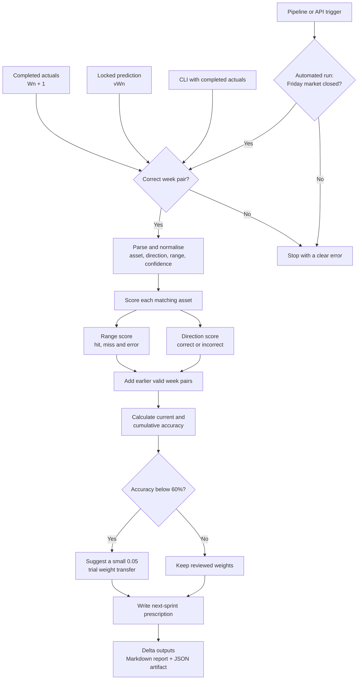
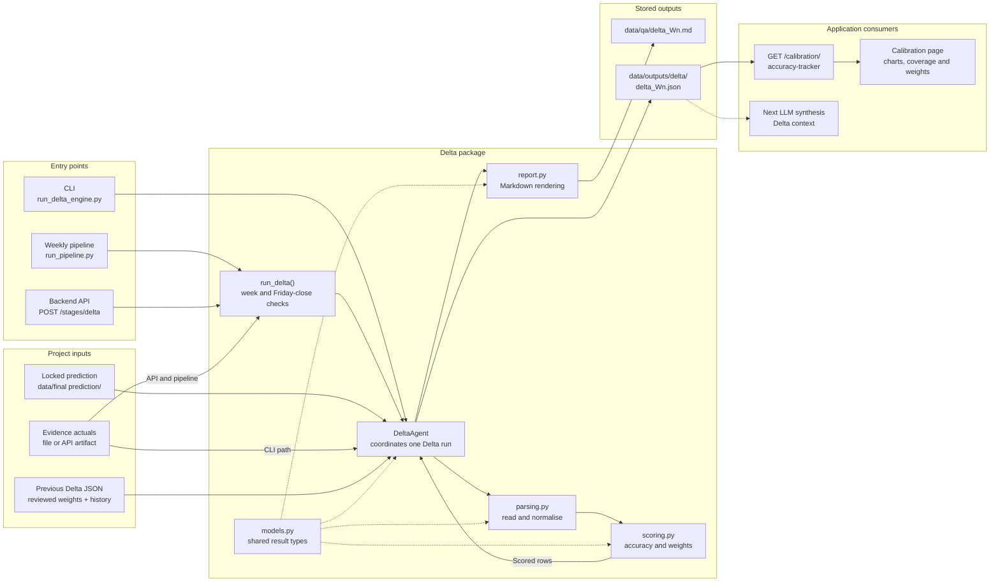

# Delta Engine: Principles and Architecture

The Delta Engine compares a locked prediction with the following completed
week. It measures accuracy, keeps valid historical results and suggests small
weight changes for the next sprint.

## How Delta Works

The automated pipeline and API enforce the Friday-close check. The CLI is a
manual tool and expects the user to provide completed actuals. The engine never
estimates a missing week. If an older prediction or its matching actuals file
is unavailable, that week is skipped and explained in the report. Suggested
weights are reviewable recommendations; Delta does not silently replace the
team's final decision.

## Application Architecture

The three entry points share the same `DeltaAgent`, so the scoring rules stay
the same whether Delta runs from the command line, the weekly pipeline or the
web application.
